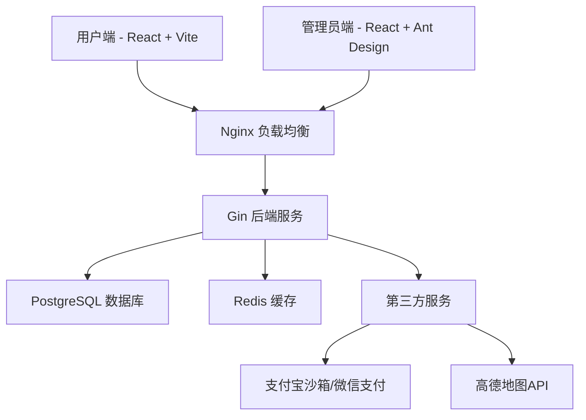

# 快马外卖点餐系统设计文档

## 📋 目录
- [项目概述](#项目概述)
- [系统架构](#系统架构)
- [技术栈](#技术栈)
- [功能需求](#功能需求)
- [数据库设计](#数据库设计)
- [API接口设计](#api接口设计)
- [开发规范](#开发规范)
- [部署方案](#部署方案)

---

## 🎯 项目概述

### 项目背景
JD外卖点餐系统是一款专门为中式菜品外卖店铺定制的**单商家**数字化点餐解决方案，采用现代前后端分离架构，集成高德地图API和ECharts数据可视化，旨在在2周实训期间完成一个功能完整、技术先进的外卖系统。

### 项目目标
- 为用户提供便捷的移动端点餐体验（基于手机浏览器）
- 为管理员提供高效的菜品管理和订单处理工具
- 实现数据可视化的销售分析和统计报表
- 集成高德地图API实现地址选择和配送功能
- 完成完整的外卖业务流程数字化管理

### 参考方案
基于黑马程序员"苍穹外卖"技术方案，采用边学边做的开发模式。
> 参考视频：[苍穹外卖项目](https://www.bilibili.com/list/ml3304073830?oid=315565756&bvid=BV1TP411v7v6&p=2)

---

## 🏗️ 系统架构

### 整体架构


### 系统模块划分
- **用户端模块**: 移动端点餐应用（手机浏览器）
- **管理端模块**: Web管理后台 + ECharts数据可视化
- **后端服务模块**: Gin API接口服务 + 统计分析
- **数据存储模块**: PostgreSQL数据库 + Redis缓存
- **第三方集成模块**: 支付宝沙箱 + 高德地图API

---

## 💻 技术栈

### 前端技术栈

#### 用户端
| 技术 | 版本 | 描述 |
|-----|------|------|
| React | 18.x | 主框架（使用Hooks） |
| Vite | 最新版 | 构建工具 |
| React Router | 6.x | 路由管理 |
| Zustand | 最新版 | 轻量级状态管理 |
| Axios | 最新版 | HTTP客户端 |
| Ant Design Mobile | 5.x | 移动端UI组件库 |
| React Hook Form | 7.x | 表单管理 |
| React Query | 4.x | 数据获取和缓存 |
| 高德地图API | - | 地址选择服务 |
| 支付宝沙箱SDK | - | 支付服务 |

**备选方案**: 微信小程序 + 微信支付

#### 管理员端
| 技术 | 版本 | 描述 |
|-----|------|------|
| React | 18.x | 主框架 |
| Ant Design | 5.x | PC端UI组件库 |
| React Router | 6.x | 路由管理 |
| Zustand | 最新版 | 状态管理 |
| React Query | 4.x | 服务端状态管理 |
| ECharts | 5.x | 数据可视化 |
| React Hook Form | 7.x | 表单管理 |

### 后端技术栈
| 技术 | 版本 | 描述 |
|-----|------|------|
| Go | 1.21+ | 编程语言 |
| Gin | 1.9.x | Web框架 |
| GORM | 1.25.x | ORM框架 |
| PostgreSQL | 15+ | 关系型数据库 |
| Redis | 7.0+ | 缓存数据库 |
| JWT-Go | 4.x | JWT身份认证 |
| Casbin | 2.x | 权限管理框架 |
| Swagger | 3.x | API文档生成 |
| Zap | 1.x | 高性能日志库 |
| Viper | 1.x | 配置管理 |
| Testify | 1.x | 测试框架 |
| Air | - | 热重载开发工具 |
| Docker | - | 容器化部署 |

---

## 📱 功能需求

### 用户端功能

#### 1. 注册登录模块
**功能描述**: 用户账号管理和身份认证

**详细需求**:
- ✅ 用户注册
  - 用户名长度校验（3-20位）
  - 密码复杂度校验（8-20位，包含字母和数字）
  - 手机号格式验证
  - 验证码验证
- ✅ 用户登录
  - 用户名/手机号登录
  - 密码验证
  - 登录状态保持
  - 失败提示机制

#### 2. 个人信息维护模块
**功能描述**: 用户个人资料和地址管理

**详细需求**:
- ✅ 个人信息管理
  - 查看个人基本信息
  - 修改姓名、联系电话
  - 头像上传和更换
- ✅ 地址管理
  - 添加送货地址
  - 修改地址信息
  - 删除地址
  - 设置默认地址
  - **集成高德地图API地址选择**
    - 📍 GPS定位获取当前位置
    - 🗺️ 地图上点击选择地址
    - 🔍 地址搜索和POI查询
    - 📍 经纬度存储和地址解析

#### 3. 历史订单模块
**功能描述**: 订单查询和消费统计

**详细需求**:
- ✅ 订单列表查看
  - 订单编号、下单时间
  - 订单金额、订单状态
  - 订单详情查看
- ✅ 消费统计
  - 日期范围选择
  - 消费总额统计
  - 订单数量统计
  - 图表展示统计结果

#### 4. 菜品浏览和点餐模块
**功能描述**: 菜品展示和购物车管理

**详细需求**:
- ✅ 菜品分类展示
  - 热菜、凉菜、汤品、套餐分类
  - 分类切换和筛选
- ✅ 菜品信息展示
  - 菜品图片、名称、价格
  - 菜品简介和详情
  - 营养信息展示
- ✅ 购物车功能
  - 添加菜品到购物车
  - 修改菜品数量
  - 删除购物车菜品
  - 购物车商品统计

#### 5. 支付模块
**功能描述**: 订单确认和在线支付

**详细需求**:
- ✅ 订单确认
  - 订单信息展示
  - 配送地址选择
  - 配送时间选择
  - 订单备注功能
- ✅ 支付功能
  - **支付宝沙箱支付**（移动端浏览器主推）
  - 微信支付（微信小程序备选）
  - 支付状态实时更新
  - 支付结果通知

### 管理员端功能

#### 1. 用户管理模块
**功能描述**: 系统用户账号管理

**详细需求**:
- ✅ 用户列表管理
  - 用户ID、用户名展示
  - 注册时间、账号状态
  - 用户信息详情查看
- ✅ 用户状态管理
  - 用户账号启用/禁用
  - 违规用户处理
  - 用户权限管理

#### 2. 员工管理模块
**功能描述**: 店铺员工账号和权限管理

**详细需求**:
- ✅ 员工账号管理
  - 添加店员账号
  - 设置用户名和初始密码
  - 分配操作权限
- ✅ 员工信息维护
  - 员工列表查看
  - 员工信息修改
  - 密码重置功能
  - 账号删除功能
- ✅ 订单处理权限
  - 接单/拒单权限
  - 配送状态更新权限
  - 订单状态管理

#### 3. 菜品管理分类模块
**功能描述**: 菜品和套餐的分类管理

**详细需求**:
- ✅ 分类管理
  - 添加菜品分类
  - 修改分类名称
  - 调整分类排序
  - 删除分类（需确保分类下无菜品）
- ✅ 菜品单品管理
  - 添加菜品信息
  - 修改菜品详情
  - 价格和库存管理
  - 菜品上架/下架
  - 优先展示设置
- ✅ 套餐管理
  - 创建菜品套餐
  - 选择套餐包含菜品
  - 设置套餐价格和描述
  - 套餐上架/下架管理

#### 4. 订单查询与统计模块 + ECharts图表
**功能描述**: 订单数据查询和业务统计分析，使用ECharts实现数据可视化

**详细需求**:
- ✅ 订单查询功能
  - 按订单编号查询
  - 按时间范围查询
  - 按订单状态筛选
  - 按用户信息查询
  - 订单详细信息展示
- ✅ **ECharts数据可视化功能**
  - 📈 销售趋势折线图（迗30天销售额变化）
  - 📊 订单量统计柱状图（按时段分布）
  - 🍰 分类销售占比饼图（各菜品分类收入占比）
  - 🍽️ 热销菜品TOP10排行榜（横向柱状图）
  - ⏰ 24小时订单分布雷达图
  - 💰 数据概览卡片（今日销售额、订单数、活跃用户等）
- ✅ 统计分析功能
  - 指定时间段统计
  - 订单总数量和总金额
  - 平均订单金额计算
  - 不同状态订单统计
  - 交互式报表和图表展示

---

## 🗃️ 数据库设计

### 核心数据表（单商家模式 + 高德地图 + ECharts支持）

#### 用户相关表
```sql
-- 用户信息表（增强版）
CREATE TABLE users (
  id BIGSERIAL PRIMARY KEY,
  name VARCHAR(32) COMMENT '姓名',
  phone VARCHAR(11) UNIQUE COMMENT '手机号（唯一）',
  email VARCHAR(100) COMMENT '邮箱地址',
  password VARCHAR(64) NOT NULL COMMENT '密码',
  sex VARCHAR(2) COMMENT '性别',
  avatar VARCHAR(500) COMMENT '头像',
  login_type INTEGER DEFAULT 1 COMMENT '登录方式 1:手机号 2:邮箱',
  last_login_time TIMESTAMP COMMENT '最后登录时间',
  is_active BOOLEAN DEFAULT TRUE COMMENT '账户是否激活',
  created_at TIMESTAMP DEFAULT CURRENT_TIMESTAMP,
  updated_at TIMESTAMP DEFAULT CURRENT_TIMESTAMP
);

-- 地址簿表（高德地图支持）
CREATE TABLE address_book (
  id BIGSERIAL PRIMARY KEY,
  user_id BIGINT NOT NULL REFERENCES users(id),
  consignee VARCHAR(50) COMMENT '收货人',
  phone VARCHAR(11) NOT NULL COMMENT '手机号',
  province_name VARCHAR(32) COMMENT '省级名称',
  city_name VARCHAR(32) COMMENT '市级名称',
  district_name VARCHAR(32) COMMENT '区级名称',
  detail VARCHAR(200) COMMENT '详细地址',
  label VARCHAR(100) COMMENT '标签',
  is_default BOOLEAN DEFAULT FALSE COMMENT '默认地址',
  -- 高德地图相关字段
  longitude DECIMAL(10, 6) COMMENT '经度',
  latitude DECIMAL(10, 6) COMMENT '纬度',
  formatted_address VARCHAR(500) COMMENT '格式化详细地址',
  created_at TIMESTAMP DEFAULT CURRENT_TIMESTAMP,
  updated_at TIMESTAMP DEFAULT CURRENT_TIMESTAMP
);

COMMENT ON TABLE users IS '用户信息表（支持多种登录方式）';
COMMENT ON TABLE address_book IS '地址簿（集成高德地图）';
```

#### 菜品相关表
```sql
-- 菜品分类表
CREATE TABLE categories (
  id BIGSERIAL PRIMARY KEY,
  type INTEGER DEFAULT 1 COMMENT '类型 1:菜品分类 2:套餐分类',
  name VARCHAR(32) NOT NULL UNIQUE COMMENT '分类名称',
  sort INTEGER DEFAULT 0 COMMENT '顺序',
  status INTEGER DEFAULT 1 COMMENT '状态 0:禁用 1:启用',
  image VARCHAR(255) COMMENT '分类图片',
  created_at TIMESTAMP DEFAULT CURRENT_TIMESTAMP,
  updated_at TIMESTAMP DEFAULT CURRENT_TIMESTAMP
);

-- 菜品表（增加销量统计）
CREATE TABLE dishes (
  id BIGSERIAL PRIMARY KEY,
  name VARCHAR(32) NOT NULL UNIQUE COMMENT '菜品名称',
  category_id BIGINT NOT NULL REFERENCES categories(id),
  price DECIMAL(10,2) DEFAULT 0.00 COMMENT '菜品价格',
  image VARCHAR(255) COMMENT '图片',
  description VARCHAR(255) COMMENT '描述信息',
  status INTEGER DEFAULT 1 COMMENT '0:停售 1:起售',
  sales_count INTEGER DEFAULT 0 COMMENT '销量统计（用于图表）',
  created_at TIMESTAMP DEFAULT CURRENT_TIMESTAMP,
  updated_at TIMESTAMP DEFAULT CURRENT_TIMESTAMP
);

-- 菜品口味表
CREATE TABLE dish_flavors (
  id BIGSERIAL PRIMARY KEY,
  dish_id BIGINT NOT NULL REFERENCES dishes(id) ON DELETE CASCADE,
  name VARCHAR(32) COMMENT '口味名称',
  value VARCHAR(255) COMMENT '口味数据list'
);

COMMENT ON TABLE categories IS '菜品分类表';
COMMENT ON TABLE dishes IS '菜品表（支持销量统计）';
COMMENT ON TABLE dish_flavors IS '菜品口味表';
```

#### 订单相关表 + 统计视图
```sql
-- 订单表（PostgreSQL版本）
CREATE TABLE orders (
  id BIGSERIAL PRIMARY KEY,
  number VARCHAR(50) UNIQUE COMMENT '订单号',
  status INTEGER DEFAULT 1 NOT NULL COMMENT '订单状态 1:待付款 2:待接单 3:已接单 4:派送中 5:已完成 6:已取消',
  user_id BIGINT NOT NULL REFERENCES users(id),
  address_book_id BIGINT NOT NULL REFERENCES address_book(id),
  order_time TIMESTAMP NOT NULL DEFAULT CURRENT_TIMESTAMP COMMENT '下单时间',
  checkout_time TIMESTAMP COMMENT '结账时间',
  pay_method INTEGER DEFAULT 2 NOT NULL COMMENT '支付方式 1:微信 2:支付宝',
  pay_status SMALLINT DEFAULT 0 NOT NULL COMMENT '支付状态 0:未支付 1:已支付',
  amount DECIMAL(10,2) NOT NULL COMMENT '实收金额',
  remark VARCHAR(100) COMMENT '备注',
  created_at TIMESTAMP DEFAULT CURRENT_TIMESTAMP,
  updated_at TIMESTAMP DEFAULT CURRENT_TIMESTAMP
);

-- 订单明细表
CREATE TABLE order_details (
  id BIGSERIAL PRIMARY KEY,
  name VARCHAR(32) COMMENT '名字',
  image VARCHAR(255) COMMENT '图片',
  order_id BIGINT NOT NULL REFERENCES orders(id) ON DELETE CASCADE,
  dish_id BIGINT REFERENCES dishes(id),
  setmeal_id BIGINT COMMENT '套餐id',
  dish_flavor VARCHAR(50) COMMENT '口味',
  number INTEGER DEFAULT 1 NOT NULL COMMENT '数量',
  amount DECIMAL(10,2) NOT NULL COMMENT '金额',
  created_at TIMESTAMP DEFAULT CURRENT_TIMESTAMP
);

-- ECharts统计视图（优化图表查询性能）
CREATE VIEW daily_sales_stats AS
SELECT 
    DATE(created_at) as sale_date,
    COUNT(*) as order_count,
    SUM(amount) as total_amount,
    AVG(amount) as avg_amount
FROM orders 
WHERE status = 5  -- 已完成订单
GROUP BY DATE(created_at)
ORDER BY sale_date DESC;

CREATE VIEW dish_sales_stats AS
SELECT 
    d.id,
    d.name,
    d.price,
    c.name as category_name,
    SUM(od.number) as total_sales,
    SUM(od.amount) as total_revenue
FROM dishes d
JOIN order_details od ON d.id = od.dish_id
JOIN orders o ON od.order_id = o.id
JOIN categories c ON d.category_id = c.id
WHERE o.status = 5
GROUP BY d.id, d.name, d.price, c.name
ORDER BY total_sales DESC;

COMMENT ON TABLE orders IS '订单表（单商家模式）';
COMMENT ON TABLE order_details IS '订单明细表';
COMMENT ON VIEW daily_sales_stats IS '日销售统计视图（ECharts支持）';
COMMENT ON VIEW dish_sales_stats IS '菜品销量统计视图（ECharts支持）';
```

---

## 🔌 API接口设计

### 用户端接口

#### 用户认证接口
```go
// 用户注册
POST /api/v1/user/register
Request Body:
{
  "username": "string",
  "password": "string", 
  "phone": "string",
  "code": "string"
}
Response:
{
  "code": 200,
  "message": "注册成功",
  "data": {
    "token": "string",
    "user_info": {
      "id": 1,
      "username": "string",
      "phone": "string"
    }
  }
}

// 用户登录
POST /api/v1/user/login
Request Body:
{
  "username": "string",
  "password": "string"
}
Response:
{
  "code": 200,
  "message": "登录成功",
  "data": {
    "token": "string",
    "user_info": {
      "id": 1,
      "username": "string",
      "phone": "string"
    }
  }
}
```

#### 菜品浏览接口
```go
// 获取菜品分类
GET /api/v1/categories
Response:
{
  "code": 200,
  "message": "success",
  "data": [
    {
      "id": 1,
      "name": "热菜",
      "type": 1,
      "sort": 1
    }
  ]
}

// 获取分类下菜品
GET /api/v1/dishes?category_id=1&page=1&limit=10
Response:
{
  "code": 200,
  "message": "success", 
  "data": {
    "items": [
      {
        "id": 1,
        "name": "宫保鸡丁",
        "price": 28.00,
        "image": "http://example.com/dish.jpg",
        "description": "经典川菜"
      }
    ],
    "total": 100,
    "page": 1,
    "limit": 10
  }
}
```

### 管理端接口

#### 统计分析接口（ECharts数据支持）
```go
// 销售趋势数据
GET /api/v1/admin/stats/sales?period=30d
Headers:
  Authorization: Bearer <token>
Response:
{
  "code": 200,
  "message": "success",
  "data": {
    "daily_sales": [
      {
        "date": "2025-01-01",
        "amount": 2580.00,
        "order_count": 45,
        "avg_amount": 57.33
      }
    ],
    "total_amount": 77400.00,
    "growth_rate": 15.6
  }
}

// 热销菜品TOP10
GET /api/v1/admin/stats/dishes?limit=10
Response:
{
  "code": 200,
  "data": {
    "top_dishes": [
      {
        "dish_id": 1,
        "name": "宫保鸡丁",
        "sales_count": 156,
        "revenue": 4368.00,
        "category": "热菜"
      }
    ]
  }
}

// 分类销售统计
GET /api/v1/admin/stats/categories
Response:
{
  "code": 200,
  "data": {
    "category_stats": [
      {
        "category": "热菜",
        "percentage": 45.2,
        "amount": 12580.00
      }
    ]
  }
}

// 24小时订单分布
GET /api/v1/admin/stats/orders/hourly
Response:
{
  "code": 200,
  "data": {
    "hourly_stats": [
      {
        "hour": 12,
        "order_count": 28
      }
    ]
  }
}
```

#### 菜品管理接口
```go
// 添加菜品
POST /api/v1/admin/dishes
Headers:
  Authorization: Bearer <token>
Request Body:
{
  "name": "宫保鸡丁",
  "category_id": 1,
  "price": 28.00,
  "image": "http://example.com/dish.jpg",
  "description": "经典川菜"
}
Response:
{
  "code": 200,
  "message": "添加成功",
  "data": {
    "id": 1
  }
}

// 更新菜品状态
PUT /api/v1/admin/dishes/{id}/status
Headers:
  Authorization: Bearer <token>
Request Body:
{
  "status": 1
}
Response:
{
  "code": 200,
  "message": "更新成功"
}

// 获取菜品列表
GET /api/v1/admin/dishes?page=1&limit=10&category_id=1&status=1
Headers:
  Authorization: Bearer <token>
Response:
{
  "code": 200,
  "message": "success",
  "data": {
    "items": [
      {
        "id": 1,
        "name": "宫保鸡丁",
        "category_id": 1,
        "price": 28.00,
        "status": 1,
        "created_at": "2025-09-06T10:00:00Z"
      }
    ],
    "total": 100,
    "page": 1,
    "limit": 10
  }
}
```

---

## 📐 开发规范

### 代码规范
- **命名规范**: 采用驼峰命名法
- **注释规范**: 关键方法必须添加注释
- **异常处理**: 统一异常处理机制
- **日志规范**: 使用SLF4J进行日志记录

### Git规范
```bash
# 分支命名
feature/功能名称    # 新功能开发
bugfix/问题描述     # 问题修复
hotfix/紧急修复     # 紧急修复

# 提交信息格式
feat: 添加用户登录功能
fix: 修复订单状态更新问题
docs: 更新API文档
style: 代码格式调整
```

### 接口规范
- **RESTful设计**: 遵循REST设计原则
- **统一响应格式**: 
  ```json
  {
    "code": 200,
    "message": "success",
    "data": {}
  }
  ```
- **错误码定义**: 建立统一错误码体系

---

## 🚀 部署方案

### 开发环境
```yaml
前端开发环境:
  - Node.js: >= 18.0.0
  - npm: >= 9.0.0 / yarn: >= 1.22.0
  - React DevTools: 浏览器插件

后端开发环境:
  - Go: >= 1.21.0
  - PostgreSQL: >= 15.0
  - Redis: >= 7.0
  - Air: 热重载工具
  - IDE: VS Code / GoLand
```

### 生产环境部署
```yaml
服务器配置:
  - OS: CentOS 7+ / Ubuntu 20.04+
  - CPU: 4核+
  - Memory: 8GB+
  - Disk: 100GB+

部署架构:
  - 前端: Nginx静态部署
  - 后端: Docker容器化部署 + Gin服务
  - 数据库: PostgreSQL主从配置
  - 缓存: Redis集群
  - 负载均衡: Nginx + upstream
  - 反向代理: Nginx
```

### 监控和运维
- **应用监控**: Gin中间件 + Prometheus指标
- **日志收集**: ELK Stack / Loki + Grafana
- **性能监控**: Prometheus + Grafana
- **错误追踪**: Sentry / Jaeger链路追踪
- **健康检查**: Gin健康检查端点

---

## 📅 开发计划（2周实训版）

### 第一周（3-4天）- 后端基础架构
- [ ] 项目初始化和环境搭建（1天）
  - PostgreSQL数据库安装和配置
  - Go开发环境搭建
  - Gin项目初始化
- [ ] 数据库设计和建表（1天）
  - 执行`postgresql_single_merchant.sql`
  - 统计视图创建
  - 数据库连接测试
- [ ] 用户认证模块开发（1天）
  - JWT认证实现
  - 用户注册/登录API
- [ ] 基础CRUD API开发（1天）
  - 菜品管理API
  - 分类管理API

### 第二周（6-7天）- 前端开发和集成
- [ ] 统计API开发（2天）
  - ECharts所需的统计接口
  - 数据聚合和计算逻辑
- [ ] 用户端前端开发（2天）
  - React项目初始化
  - 菜品浏览和购物车
  - 订单提交功能
- [ ] 管理端 + ECharts开发（2天）
  - 管理员登录和菜品管理
  - ECharts图表集成
  - 数据可视化仪表板
- [ ] 集成测试和优化（1天）
  - 功能测试和修复
  - 性能优化
  - 部署和演示准备

### 重点功能优先级
1. **最高优先级**: 基础CRUD + 用户认证
2. **高优先级**: ECharts统计图表（体现技术亮点）
3. **中优先级**: 高德地图集成
4. **低优先级**: 支付功能（可用模拟数据）

---

## 📖 参考资料

- [React官方文档](https://react.dev/)
- [Gin框架文档](https://gin-gonic.com/docs/)
- [GORM文档](https://gorm.io/docs/)
- [PostgreSQL官方文档](https://www.postgresql.org/docs/)
- [Ant Design组件库](https://ant.design/)
- [高德地图API文档](https://lbs.amap.com/)
- [支付宝开放平台](https://opendocs.alipay.com/)
- [Redis官方文档](https://redis.io/documentation)

## 🚀 技术栈优化建议

基于你选择的技术栈，我有以下优化建议和补充：

### 💡 核心技术栈优化

#### 1. **用户认证和授权推荐**
```go
// 推荐技术栈
- JWT-Go: JSON Web Token实现
- Casbin: 基于RBAC的权限管理
- Bcrypt: 密码加密
- Redis: Session存储和Token黑名单
```

**优势**:
- Casbin提供灵活的权限模型（RBAC、ABAC等）
- JWT无状态，便于分布式部署
- Redis缓存提高认证性能

#### 2. **数据缓存策略**
```go
// 推荐缓存方案
- Redis: 主缓存（菜品数据、用户Session）
- go-redis: Go Redis客户端
- 分布式锁: 防止缓存穿透
- 缓存更新策略: Write-Through + TTL
```

#### 3. **消息队列推荐**
```go
// 异步处理推荐
- RabbitMQ: 订单状态变更通知
- Apache Kafka: 大数据分析和日志收集（可选）
- Go Channel: 本地异步任务处理
```

### 🔧 开发效率提升工具

#### 1. **代码生成工具**
```bash
# CRUD代码自动生成
- gorm-gen: GORM代码生成器
- swaggo/swag: Swagger文档自动生成
- wire: 依赖注入代码生成
```

#### 2. **开发调试工具**
```bash
# 开发辅助工具
- Air: 热重载开发
- Delve: Go调试器
- pprof: 性能分析
- godotenv: 环境变量管理
```

#### 3. **数据库相关**
```bash
# PostgreSQL生态
- golang-migrate: 数据库迁移
- pgx: 高性能PostgreSQL驱动
- pg_stat_statements: SQL性能分析
```

### 🎯 微服务架构建议

如果后续需要扩展为微服务，推荐：

```go
// 微服务技术栈
- gRPC: 服务间通信
- Consul: 服务发现和配置中心
- Jaeger: 分布式链路追踪
- Prometheus: 监控指标收集
- Docker Compose: 本地开发环境
- Kubernetes: 生产环境编排
```

### 📊 性能优化建议

#### 1. **数据库优化**
```sql
-- PostgreSQL性能优化
- 合理使用索引（B-tree、Hash、GIN）
- 分区表处理大数据量
- 连接池配置优化
- 查询计划分析（EXPLAIN ANALYZE）
```

#### 2. **缓存优化**
```go
// 多级缓存策略
- L1: 本地缓存（go-cache）
- L2: Redis分布式缓存
- L3: CDN静态资源缓存
```

### 🔒 安全性增强

```go
// 安全相关推荐
- Helmet.js: HTTP安全头（前端）
- Rate Limiter: API限流
- CORS中间件: 跨域安全
- SQL注入防护: GORM参数化查询
- XSS防护: 输入验证和输出编码
```

### 📱 前端性能优化

```javascript
// React性能优化建议
- React.memo: 组件缓存
- useMemo/useCallback: 计算缓存
- Code Splitting: 路由懒加载
- PWA: 离线支持
- Vite预构建: 依赖优化
```

### 🧪 测试策略

```go
// 测试工具推荐
- Testify: 断言和Mock框架
- GoConvey: BDD测试框架
- Gin测试: HTTP接口测试
- 数据库测试: testcontainers-go
```

### 💾 数据备份和恢复

```bash
# PostgreSQL备份策略
- pg_dump: 逻辑备份
- pg_basebackup: 物理备份
- WAL归档: 增量备份
- 定时任务: 自动备份脚本
```

## 📋 技术选型对比

| 技术类别 | 当前选择 | 替代方案 | 推荐理由 |
|---------|---------|---------|----------|
| 后端框架 | Gin | Fiber, Echo | Gin生态成熟，性能优秀 |
| ORM | GORM | Ent, sqlx | GORM功能全面，社区活跃 |
| 数据库 | PostgreSQL | MySQL, MongoDB | PG功能强大，JSON支持好 |
| 缓存 | Redis | Memcached | Redis数据结构丰富 |
| 前端状态管理 | Zustand | Redux, Jotai | Zustand轻量简单 |
| UI组件库 | Ant Design | Material-UI | 中文文档完善 |

---

*文档版本: v1.0 | 最后更新: 2025-09-06*