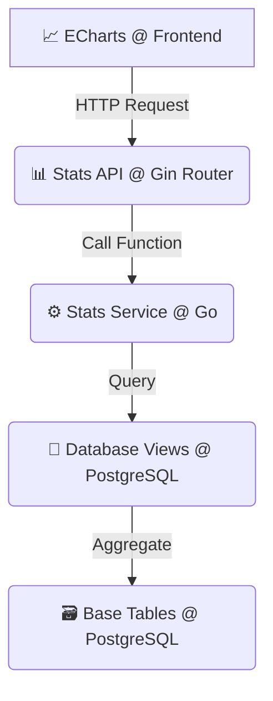

# 📊 JD外卖统计与核心业务系统设计 v2.1

**文档目标**: 详细阐述JD外卖项目的核心业务逻辑、数据处理策略及统计功能的设计与实现，作为开发和维护的核心参考。

**最后更新**: 2025年9月11日

## 1. 核心设计哲学：数据完整性优先

本系统的所有设计都遵循一个核心原则：**保证核心业务数据的完整性和历史可追溯性**。这意味着，任何与历史订单相关联的数据都不能被物理删除，以确保统计分析和业务审计的准确性。基于此原则，我们针对不同数据实体设计了精细化的归档策略。

---

## 2. 数据归档与删除策略

针对系统中不同的数据实体，我们根据其业务属性，设计了两种不同的处理方式：“**软删除** (Soft Delete)”和“**状态标记** (Status Flag)”。

| 模块 (Module) | 目标实体 (Entity) | 业务含义 (Business Meaning) | 技术实现 (Technical Implementation) |
| :--- | :--- | :--- | :--- |
| **商品管理** | `Dishes`, `Setmeals`, `Categories` | 下架/停售 (Discontinue) | **软删除**：使用GORM内置的 `gorm.DeletedAt` 字段。 |
| **人员管理** | `Employees` | 离职/禁用 (Resign/Disable) | **软删除**：使用 `gorm.DeletedAt` 字段。 |
| **用户管理** | `Users` | 禁用/封号 (Deactivate/Ban) | **状态标记**：使用 `is_active` (boolean) 字段。 |
| **订单管理** | `Orders` | 取消/退款 (Cancel/Refund) | **状态标记**：使用 `status` (integer) 字段，例如 `6` 代表已取消。 |

### 2.1 软删除 (Soft Delete)

- **适用对象**: `菜品 (Dishes)`、`套餐 (Setmeals)`、`分类 (Categories)`、`员工 (Employees)`。
- **实现方式**:
    1. 在GORM模型中嵌入 `gorm.DeletedAt` 字段。
    2. 当执行删除操作时，GORM会自动将SQL `DELETE` 转换为 `UPDATE table SET deleted_at = '...' WHERE id = ?`。
    3. 所有常规查询（如 `db.Find(&dishes)`)，GORM会自动附加 `WHERE deleted_at IS NULL` 条件，对业务代码透明。
- **优势**: 业务代码无需关心“已删除”状态，框架层面保证了数据的隔离性，同时保留了所有历史数据以供分析。

### 2.2 状态标记 (Status Flag)

- **适用对象**: `用户 (Users)`、`订单 (Orders)`。
- **实现方式**:
    1. 在模型中定义明确的状态字段，如 `users.is_active` 或 `orders.status`。
    2. 业务逻辑通过 `UPDATE` 语句修改这些字段的值来改变实体状态。
    3. 所有查询都需要在业务代码中显式地加入 `WHERE` 条件来筛选所需状态的实体，例如 `db.Where("status = ?", 5).Find(&orders)`。
- **优势**: 提供了更丰富的业务状态管理能力，例如订单的“待付款”、“待接单”、“派送中”等多种状态流转。

---

## 3. 统计系统架构

为了支撑前端高效、实时的数据可视化需求，统计系统采用了**服务层 -> 数据库视图**的分层架构，以实现高性能的聚合查询。

### 3.1 数据流动示意图



### 3.2 架构解析

1.  **前端 (Frontend)**: React组件 (如 `SalesChart.jsx`) 使用 ECharts 库负责图表渲染，并通过 `api.js` 发起API请求。
2.  **API层 (API Layer)**: Gin Router (`router.go`) 定义了面向前端的RESTful接口，负责接收请求、参数校验，并调用服务层。
3.  **服务层 (Service Layer)**: Go的 `StatsService` (`stats_service.go`) 封装了核心业务逻辑。它不直接查询原始数据表，而是查询经过优化的数据库视图。
4.  **视图层 (View Layer)**: 在PostgreSQL中预先定义了一系列视图 (Views)，这些视图使用 `JOIN` 和 `GROUP BY` 将复杂的聚合运算（如按日统计销售额）提前完成。
5.  **数据层 (Data Layer)**: 原始的基础业务数据表，如 `orders`, `order_details` 等。

---

## 4. 后端实现详解

### 4.1 数据库视图 (Database Views)

视图是统计性能的基石。以下是项目中定义的四个核心统计视图（源于 `postgresql_single_merchant.sql`）：

<details>
<summary><strong>1. 每日销售统计视图 (daily_sales_stats)</strong></summary>

```sql
CREATE VIEW daily_sales_stats AS
SELECT
    DATE(created_at) as sale_date,
    COUNT(*) as order_count,
    SUM(amount) as total_amount,
    AVG(amount) as avg_amount
FROM orders
WHERE status = 5  -- 只统计已完成订单
GROUP BY DATE(created_at)
ORDER BY sale_date DESC;
```
</details>

<details>
<summary><strong>2. 菜品销量统计视图 (dish_sales_stats)</strong></summary>

```sql
CREATE VIEW dish_sales_stats AS
SELECT
    d.id,
    d.name,
    d.price,
    c.name as category_name,
    SUM(od.number) as total_sales,
    SUM(od.amount) as total_revenue
FROM dishes d
JOIN order_details od ON d.id = od.dish_id
JOIN orders o ON od.order_id = o.id
JOIN categories c ON d.category_id = c.id
WHERE o.status = 5
GROUP BY d.id, d.name, d.price, c.name
ORDER BY total_sales DESC;
```
</details>

<details>
<summary><strong>3. 用户消费统计视图 (user_consumption_stats)</strong></summary>

```sql
CREATE VIEW user_consumption_stats AS
SELECT
    u.id,
    u.name,
    u.phone,
    COUNT(o.id) as order_count,
    SUM(o.amount) as total_consumption,
    AVG(o.amount) as avg_order_amount,
    MAX(o.created_at) as last_order_time
FROM users u
JOIN orders o ON u.id = o.user_id
WHERE o.status = 5
GROUP BY u.id, u.name, u.phone
ORDER BY total_consumption DESC;
```
</details>

<details>
<summary><strong>4. 分类销售统计视图 (category_sales_stats)</strong></summary>

```sql
CREATE VIEW category_sales_stats AS
SELECT
    c.id,
    c.name as category_name,
    COUNT(od.id) as dish_count,
    SUM(od.number) as total_quantity,
    SUM(od.amount) as total_revenue
FROM categories c
JOIN dishes d ON c.id = d.category_id
JOIN order_details od ON d.id = od.dish_id
JOIN orders o ON od.order_id = o.id
WHERE o.status = 5
GROUP BY c.id, c.name
ORDER BY total_revenue DESC;
```
</details>

### 4.2 核心统计API接口

以下是 `router.go` 中定义的、供前端调用的核心统计API，均需要管理员权限。

| Method | Endpoint | 控制器方法 (Controller Method) | 功能描述 |
| :--- | :--- | :--- | :--- |
| `GET` | `/api/v1/admin/dashboard/overview` | `statsController.GetDashboardOverview` | 获取工作台核心指标 |
| `GET` | `/api/v1/admin/stats/sales` | `statsController.GetSalesTrend` | 获取指定时间段的销售趋势 |
| `GET` | `/api/v1/admin/stats/dishes` | `statsController.GetDishRanking` | 获取热销菜品排行 |
| `GET` | `/api/v1/admin/stats/categories` | `statsController.GetCategoryStats` | 获取各分类的销售统计 |

**通用查询参数**:
- `start_date` (string): 筛选范围的开始日期 (格式: `YYYY-MM-DD`)
- `end_date` (string): 筛选范围的结束日期 (格式: `YYYY-MM-DD`)

---

## 5. 工作台与数据导出

### 5.1 工作台核心指标

工作台 (`/dashboard/overview`) 是管理员登录后看到的第一个页面，提供最核心的5个实时业务指标：
1.  **营业额**: 指定时间范围内的总销售额 (来源: `daily_sales_stats`)。
2.  **有效订单**: 指定时间范围内的已完成订单总数 (来源: `daily_sales_stats`)。
3.  **订单完成率**: `(已完成订单数 / (已完成订单数 + 已取消订单数)) * 100%`。
4.  **平均客单价**: `总营业额 / 有效订单数`。
5.  **新增用户数**: 指定时间范围内新注册的用户数 (来源: `users` 表)。

### 5.2 数据导出功能

- **实现方式**: 后端提供统一的 `/api/v1/admin/export/data` 接口。
- **控制器方法**: `statsController.ExportData`。
- **支持格式**: `Excel (XLSX)`。
- **请求体示例**:
    ```json
    {
      "data_type": "sales", // 可选值: "sales", "dishes", "categories"
      "start_date": "2025-01-01",
      "end_date": "2025-01-31"
    }
    ```
- **响应**: 后端根据 `data_type` 查询对应视图，生成Excel文件，并通过文件流形式直接返回给前端触发下载。

---